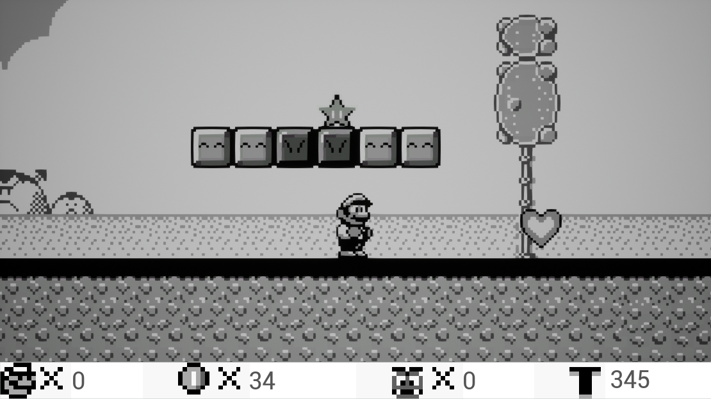
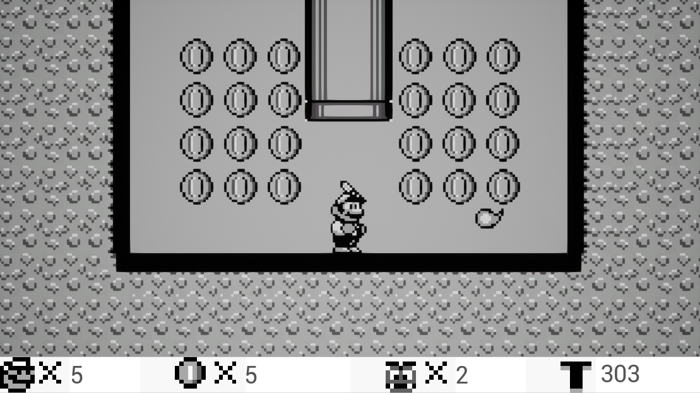
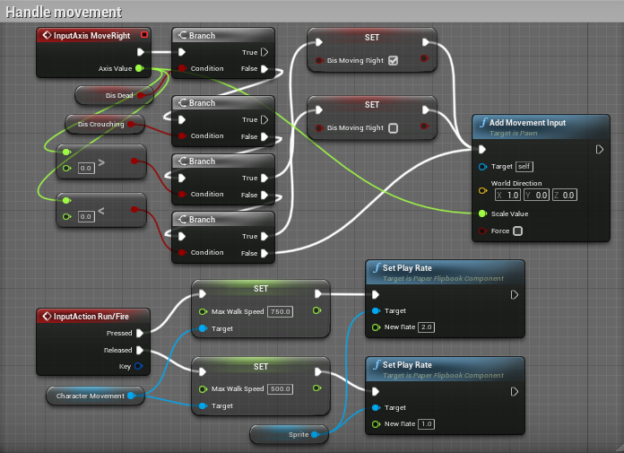
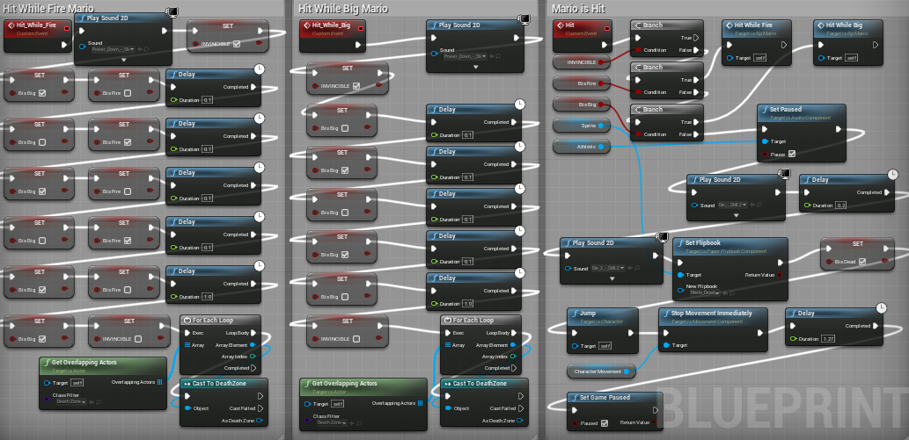
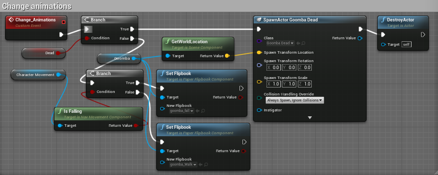

  
  

 
 This game was made as the requirements for a self-directed class I took at NSCC. The subject I decided to tackle was that of the unreal engine and its blueprints. This allowed me to flex my fast-learning skills and allow for me to work on a game which was a dream of mine as a kid.

 While learning unreal for this project I gained a new sense of respect for all programmers as this project wasn't a particularly huge one, I only made the first level, and most were working on projects much, much larger than that. This also however, added fuel to the fire when it comes to my passion for the IT field as I know that my best days are still ahead of me. 

Below are a few screen shots of the games blueprints:

  
  
  

Project Link: <a href="https://github.com/EthanSchaller/Super-Mario-Land-2-Unreal"><i class="large github icon"></i>EthanSchaller/Super-Mario-Land-2-Unreal</a>

 