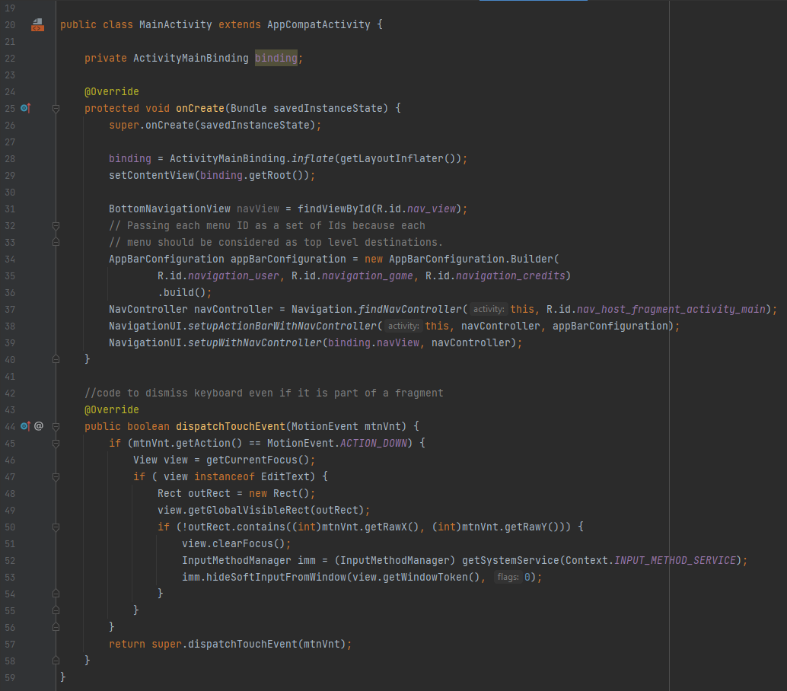

  
  
  

 
 This program is the classic game Blackjack you know and love made for the Android platform. The app consists of a first page that a user can input a name into to be referred as in the game. A second page is used for the gameplay of the game and consists of 5 flipped cards for each person (the user and teh house). The user’s score is tracked and shown to allow for the user to have a sense of drive to keep playing. The final page is a little about/credits page. 

 This was a project from my mobile app development course at NSCC and was a really fun one to work on. Blackjack is a game that i could personally spend hours playing without even batting an eye so the fact that I made one makes me very proud that I could show this off to people and call it my own.

 This was the first game, albeit a card game, that I was able to work on and it really sparked the drive in me to pursue the game coding side of programming more. This was later strengthened to a higher degree with later projects such as my version of <em>Pacman</em> in Java and <em>Mario Land 2</em> in Unreal Engine 4.

 This project helped me learn the ins and outs of mobile programming that I was later able to transfer to C# and swift when coding for iOS devices and, on top of that, helped grow my coding repertoire even more. 

Below are a few screen shots of the source code:

  
  
  

Link to project: <a href="https://github.com/EthanSchaller/AndroidBlackjack"><i class="large github icon"></i>EthanSchaller/AndroidBlackjack</a>

 