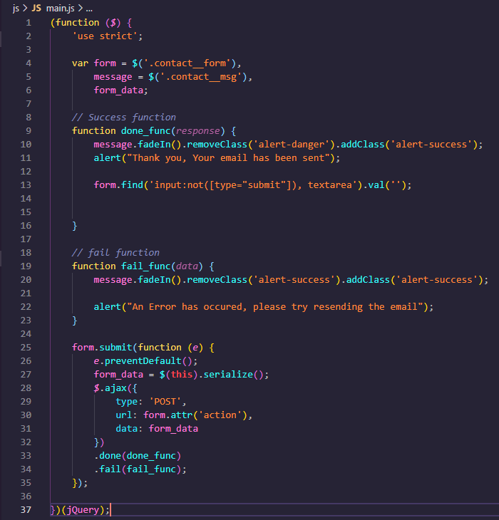
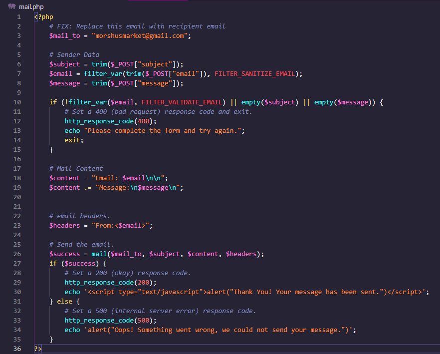

 
This website is a mock-up store page based on a fiction company revolving around the video game character Morshu from the <em>Legend of Zelda</em> CDI game. This website has alist of 10 hand selected games, one of which I made up and used, aswell as an about me section and a comments section. The email linked is a real one and you can actually contact it but, as it says on the website itself, I don't check it often and may not see any messages for a while on that specific email.

This project really let my creative juices flow and allowed me to grow my passion for the art of programming to blossem to the nth degree and really allowed me to show my more creative side. I created a whole new company around an obscure shopkeeper from a not so beloved game into the face of a company all based on a joke and, in my opinion, it couldn't have gone better. The games selected were ones that I enjoyed while I was growing up all the way to games I picked up in the past year allowing me to express myself with my coding in a way that, up until now, I wasn't able to do.

This project elevated my HTML and PHP skills higehr than ever before and allowed me to practice them in a fun way leading to my raised passion. It also showed me that making meaningful and fun projects is waht drives me to be in this field, and do you know what? I wouldn't have it anyother way. 

Below are a few screen shots of the source code:

  
  

Link to project: <a href="https://github.com/EthanSchaller/StoreWebpage"><i class="large github icon "></i>EthanSchaller/StoreWebpage</a>

 