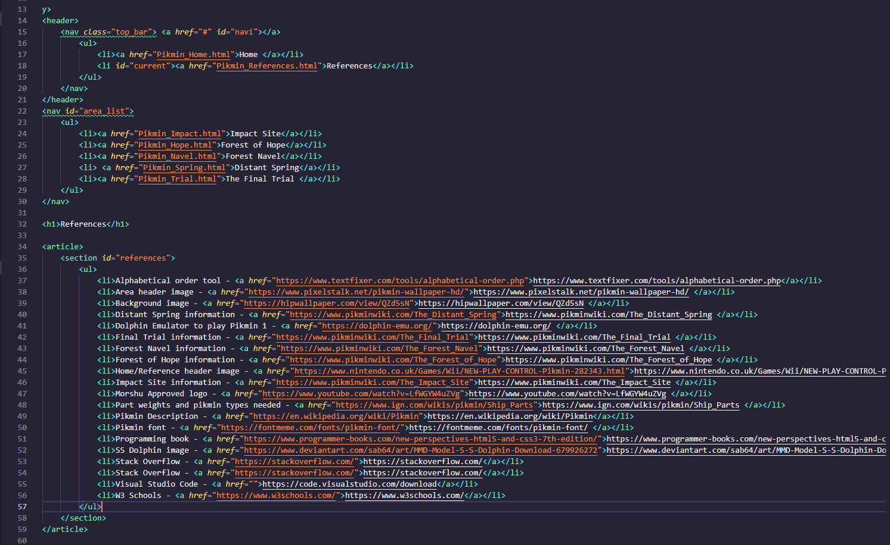
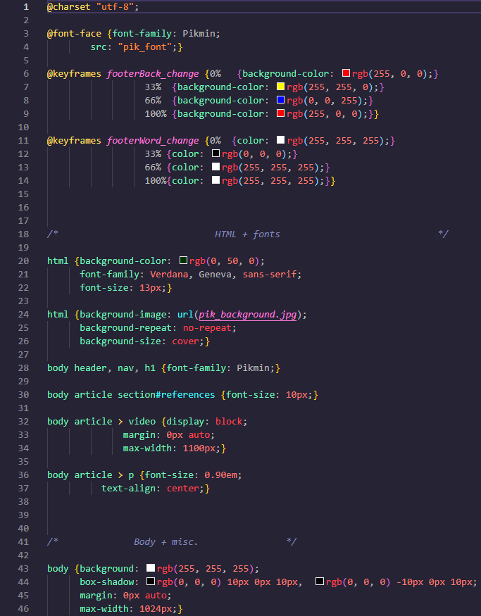
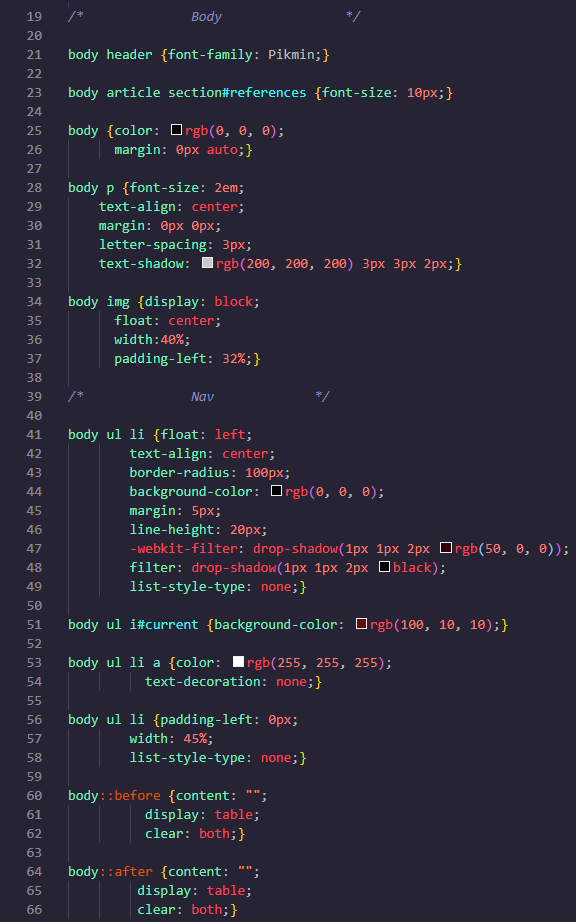

 
 This website is a great helpful guide for one of my favorite games of all time, Pikmin 1. The site covers all the items in the game that the character needs to collect and which area to find them in. It also goes more in-depth by showing the exact amount of Pikmin needed to carry the item as well as the needed/recommended type of Pikmin to use. The area of each item is shown on a handy map that is placed at the top of each areas section to help even more with the location of each item.

 This website was one of my first major projects in my time a t NSCC and a very fun one to work on. This project allowed me to represent my favorite game series of all time and show my web programming skills that I had acquired up to that point. Doing this project made me realize, although my main goal with programming isn't to make websites, it is a fun thing to do and would be a great path, nonetheless.

Below are a few screen shots of the source code:

  
  
  

Link to project: <a href="https://github.com/EthanSchaller/Pikmin-Webpage"><i class="large github icon "></i>EthanSchaller/Pikmin-Webpage</a>

 