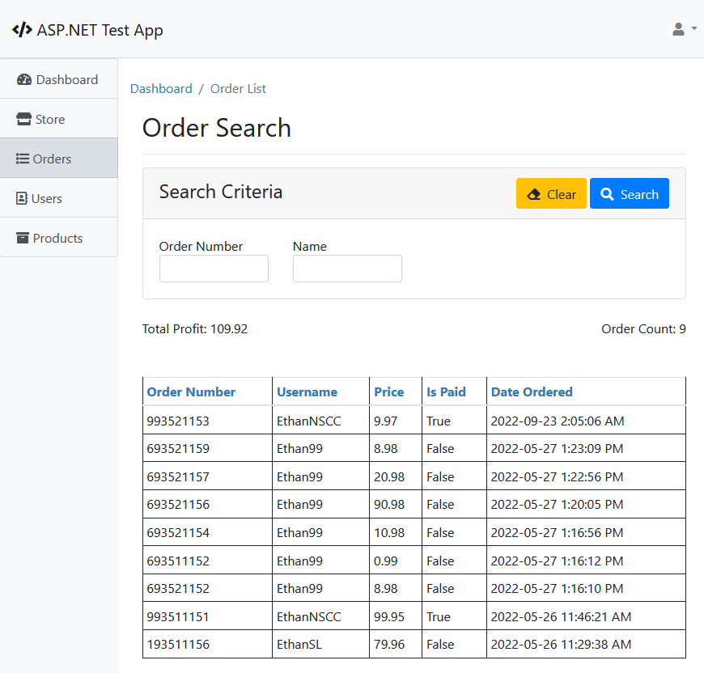
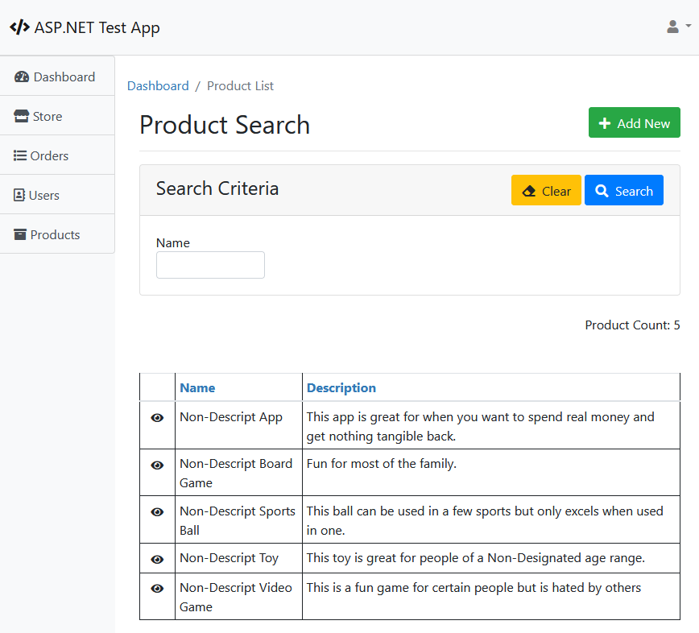
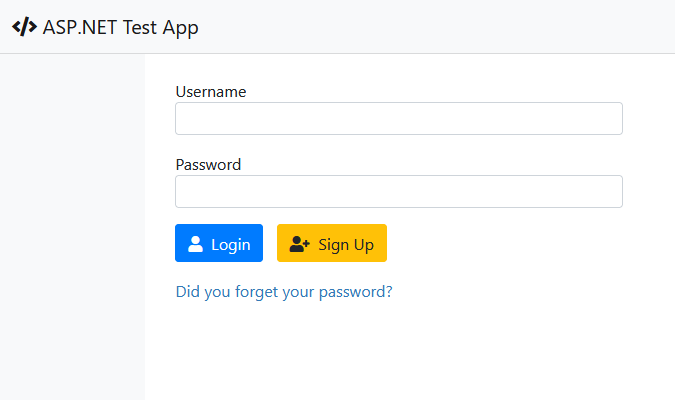
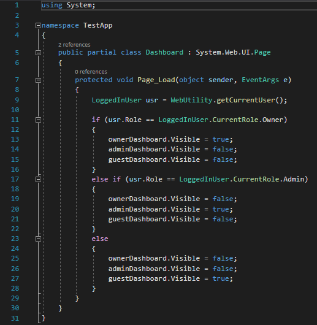
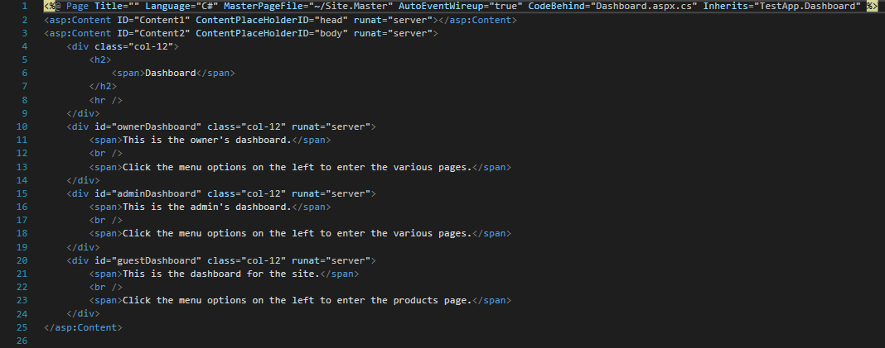
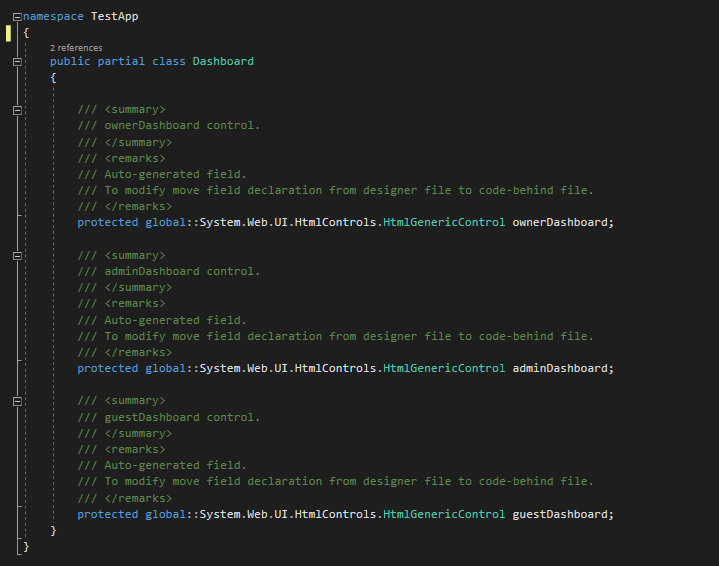
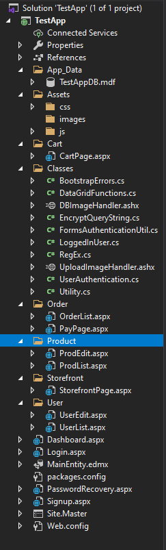

  
  
  

 

This was a test site I've made while doing my work term at Scotia Logic. Some of the code samples and design ideas I used, with permission, from projects I was working on at the time.

This site was used to test out different features I was working on or learning different aspects of the language. I mainly worked on the different parts in my spare time or when I wanted to test some changes in a more controlled environment without harming the sites I was working on.

In the end I was able to learn a lot about ASP.Net and how to code with it, something I never did before, and was even able to help implement a lot of aspects I learned about into an internal site I helped build for them.

Below are a few screen shots of the source code:

  
  
  
  

Project Link: <a href="https://github.com/EthanSchaller/ASP.Net-Test"><i class="large github icon"></i>EthanSchaller/ASP.Net-Test</a>

 