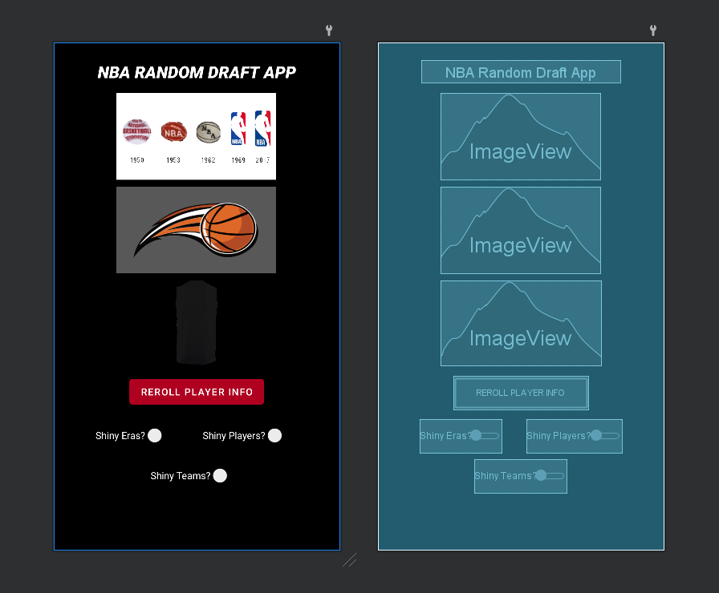
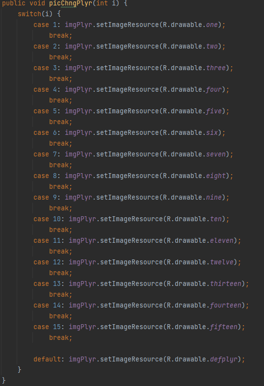
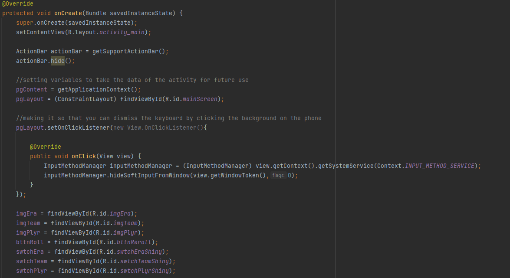
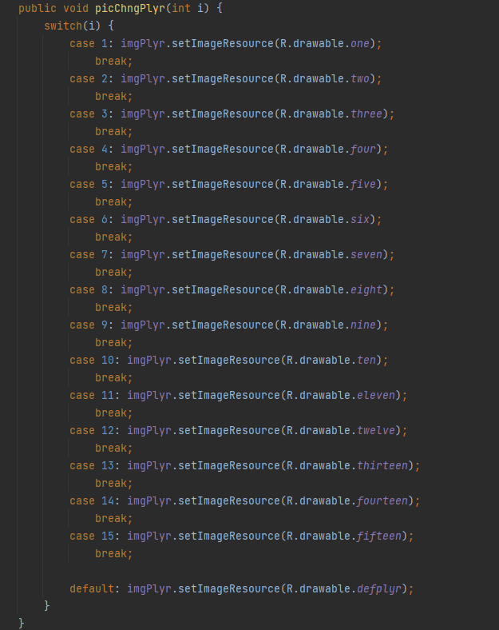

  

 

I originally came up with this idea when me and my brother wanted to create randomized teams to play against each other with. We did this by looking up the random number generator from Google to get the players. This gave me the idea to add all the different steps that we were doing through google to the app and to trigger with the click of a button, or 2 if you want to be even more random :).

The top image, Era, is to show if the player would be on a historic team, the all-time team, or the current. The second image, Team, is to show which team the player would be on. The third and final image, Position/Number, is to show what position in the roster the player is in.

Because it is for fun, I added in three buttons to activate 'Shiny' mode for each image. 'Shiny' mode adds in the ability to get a 'Shiny' image (era's says "Any Era" on it, team's has every team in the image, and number's shows a jersey with a number of 00) which allows you to pick what option you want in the section that is 'Shiny'.

Although this app is quite niche in its use me and my brother have been using it ever since to create any number of randomized nba things.

Below are a few screen shots of the source code:

  
  
  

Project Link: <a href="https://github.com/EthanSchaller/NBA-Team-Randomizer"><i class="large github icon"></i>EthanSchaller/NBA-Team-Randomizer</a>

 